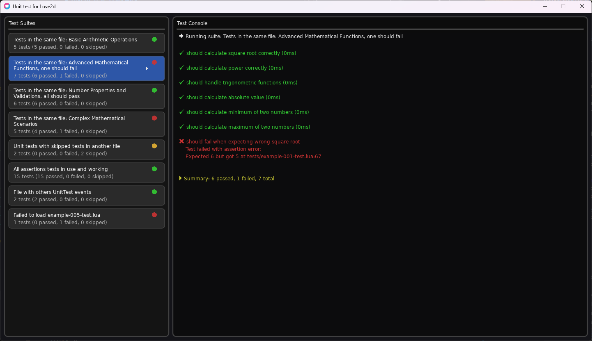

# LÖVE2D Test Framework

A comprehensive JUnit-style testing framework for LÖVE2D (Lua) projects, featuring a modern UI interface and extensive assertion library.


## Features

- **JUnit-style Testing**: Familiar describe/it pattern for organizing tests
- **Rich Assertion Library**: 15+ assertion methods for comprehensive testing
- **UI Interface**: Visual test runner with interactive panels
- **Setup/Teardown Hooks**: beforeAll, afterAll, beforeEach, afterEach support
- **Test Modifiers**: Skip tests with `xit` or focus with `fit`
- **Error Handling**: Detailed error reporting with stack traces
- **Scroll Support**: Handle large test suites with draggable scrollbars
- **Icon Font Integration**: Visual status indicators for test results

## UI Interface

The UI interface provides a visual representation of your test suites and results, making it easier to navigate and understand the state of your tests.



## Requirements

- **LÖVE2D 11.0+** (https://love2d.org/)
- **Lua 5.1+** (included with LÖVE2D)

## Quick Start

### Installation

1. **Copy the test framework to your LÖVE2D project:**
   ```
   your-love2d-project/
   ├── main.lua                  # Your game's main file
   ├── src/                      # Your game source code
   └── test/                     # Testing framework (Create this directory and copy this repository into it)
       ├── main.lua              # Test runner entry point
       ├── test-framework.lua    # Core testing framework
       ├── ui/                   # Test UI components (optional)
       │   ├── test-screen.lua
       │   ├── test-list-panel.lua
       │   ├── test-console-panel.lua
       │   └── test-scrollpanel.lua
       └── tests/                # Your test files go here
           └── example-test.lua
   ```

2. **Create your first test file:**
   ```lua
   -- test/tests/math-test.lua
   local TestFramework = require("test-framework")

   describe("Basic Math Operations", function(ctx)
        ctx.it("should add two numbers correctly", function()
            local result = 2 + 3
            assert.equals(result, 5)
        end)

        -- or ctx.test. It's the same execution function, just aliased
        ctx.test("should multiply numbers correctly", function()
            local result = 4 * 5
            assert.equals(result, 20)
        end)
   end)

   describe("String Operations", function(ctx)
        ctx.it("should concatenate strings", function()
            local result = "Hello " .. "World"
            assert.equals(result, "Hello World")
        end)
   end)
   ```

3. **Run your tests:**
   ```bash
   # Navigate to your project directory
   cd your-love2d-project/

   # Run tests with LÖVE2D
   love test/
   ```

## Framework API

### Test Structure

#### Describe/It Pattern
```lua
describe("Test Suite Name", function(ctx)
    ctx.it("should do something", function()
        -- Test implementation
        assert.equals(actual, expected)
    end)
end)
```

#### Setup/Teardown Hooks
```lua
describe("Database Tests", function(ctx)
    local db

    -- Run once before all tests in this suite
    ctx.beforeAll(function()
        db = Database.connect()
    end)

    -- Run once after all tests in this suite
    ctx.afterAll(function()
        db:close()
    end)

    -- Run before each test
    ctx.beforeEach(function()
        db:beginTransaction()
    end)

    -- Run after each test
    ctx.afterEach(function()
        db:rollback()
    end)

    ctx.it("should insert record", function()
        -- Test implementation
    end)
end)
```

### Assertion Library

#### Basic Assertions
```lua
assert.equals(actual, expected, message?)
assert.notEquals(actual, expected, message?)
assert.assertTrue(condition, message?)
assert.assertFalse(condition, message?)
assert.assertNil(value, message?)
assert.assertNotNil(value, message?)
assert.assertType(value, expectedType, message?)
```

#### Numeric Assertions
```lua
assert.assertGreater(actual, expected, message?)
assert.assertLess(actual, expected, message?)
assert.assertGreaterOrEqual(actual, expected, message?)
```

#### Table/Array Assertions
```lua
assert.assertTableEquals(actual, expected, message?)
assert.assertContains(table, value, message?)
assert.assertNotContains(table, value, message?)
```

#### Exception Testing
```lua
assert.assertThrows(function, expectedError?, message?)
```

### Test Modifiers

```lua
-- Skip a test
ctx.xit("should be skipped", function()
    -- This test will be skipped during execution
end)

-- Focus on specific tests (only these will run)
ctx.fit("should run only this test", function()
    -- Only focused tests will execute
end)
```

## Example Test Suite

```lua
-- test/tests/game-logic-test.lua
local TestFramework = require("test-framework")

describe("Player System", function(ctx)
    local player

    ctx.beforeEach(function()
        player = {
            health = 100,
            mana = 50,
            level = 1
        }
    end)

    ctx.it("should have correct initial values", function()
        assert.equals(player.health, 100)
        assert.equals(player.mana, 50)
        assert.equals(player.level, 1)
    end)

    ctx.it("should take damage correctly", function()
        local initialHealth = player.health
        player.health = player.health - 25
        
        assert.assertLess(player.health, initialHealth)
        assert.equals(player.health, 75)
    end)

    ctx.it("should not have negative health", function()
        player.health = math.max(0, player.health - 150)
        
        assert.assertGreaterOrEqual(player.health, 0)
        assert.equals(player.health, 0)
    end)
end)

describe("Inventory System", function(ctx)
    ctx.it("should add items to inventory", function()
        local inventory = {}
        local item = {name = "Health Potion", quantity = 1}
        
        table.insert(inventory, item)
        
        assert.assertNotNil(inventory[1])
        assert.assertContains(inventory, item)
        assert.equals(#inventory, 1)
    end)

    ctx.it("should handle item stacking", function()
        local items = {
            {name = "Health Potion", stackable = true},
            {name = "Sword", stackable = false}
        }
        
        assert.assertTrue(items[1].stackable)
        assert.assertFalse(items[2].stackable)
    end)
end)
```

## Advanced Usage

### Testing Game Objects

```lua
-- Testing LÖVE2D game objects
describe("Sprite System", function(ctx)
    local sprite

    ctx.beforeEach(function()
        -- Mock or create test sprites
        sprite = {
            x = 0,
            y = 0,
            width = 32,
            height = 32,
            visible = true
        }
    end)

    ctx.it("should move sprite correctly", function()
        sprite.x = sprite.x + 10
        sprite.y = sprite.y + 5
        
        assert.equals(sprite.x, 10)
        assert.equals(sprite.y, 5)
    end)

    ctx.it("should detect collision", function()
        local other = {x = 5, y = 5, width = 32, height = 32}
        
        local function checkCollision(a, b)
            return a.x < b.x + b.width and
                   a.x + a.width > b.x and
                   a.y < b.y + b.height and
                   a.y + a.height > b.y
        end
        
        assert.assertTrue(checkCollision(sprite, other))
    end)
end)
```

### Testing with Mocks

```lua
describe("Audio System", function(ctx)
    local audioMock

    ctx.beforeEach(function()
        audioMock = {
            sounds = {},
            play = function(self, sound)
                table.insert(self.sounds, sound)
            end,
            getPlayCount = function(self)
                return #self.sounds
            end
        }
    end)

    ctx.it("should play sound effects", function()
        audioMock:play("jump.wav")
        audioMock:play("coin.wav")
        
        assert.equals(audioMock:getPlayCount(), 2)
        assert.assertContains(audioMock.sounds, "jump.wav")
    end)
end)
```

## Test UI Interface

The framework includes a modern test interface featuring:

- **Left Panel**: Test suite list with visual status indicators
  - Green circle: All tests passed
  - Red circle: Some tests failed  
  - Yellow circle: Some tests skipped
  - Click to view specific test results

- **Right Panel**: Console output with detailed results
  - Real-time test execution feedback
  - Error messages with stack traces
  - Icon font support for visual indicators

- **Interactive Features**:
  - Draggable scroll bars for large test suites
  - Dynamic layout that adapts to long test names
  - Color-coded status messages

## Integration Examples

### Existing LÖVE2D Project

If you have an existing LÖVE2D project structure like this:
```
my-game/
├── main.lua
├── conf.lua
├── src/
│   ├── player.lua
│   ├── enemy.lua
│   └── gamestate.lua
└── assets/
```

Add the test framework:
```
my-game/
├── main.lua
├── conf.lua
├── src/
│   ├── player.lua
│   ├── enemy.lua
│   └── gamestate.lua
├── assets/
└── test/                    # Add this folder
    ├── main.lua             # Copy from this repository
    ├── test-framework.lua   # Copy from this repository
    ├── ui/                  # Copy from this repository (optional)
    └── tests/               # Create your test files here
        ├── player-test.lua
        ├── enemy-test.lua
        └── gamestate-test.lua
```

### Testing Game Modules

```lua
-- test/tests/player-test.lua
-- You can access your game modules like this:

local Player = require("src.module.module1.player")  -- Your game module

describe("Player Module", function(ctx)
    local player

    ctx.beforeEach(function()
        player = Player.new(100, 100)  -- x, y position
    end)

    ctx.it("should create player with correct position", function()
        assert.equals(player.x, 100)
        assert.equals(player.y, 100)
        assert.assertNotNil(player)
    end)

    ctx.it("should move player", function()
        player:move(10, 5)
        
        assert.equals(player.x, 110)
        assert.equals(player.y, 105)
    end)
end)
```

## Best Practices

1. **Organize Tests by Module**: Create one test file per game module
2. **Use Descriptive Names**: Test names should clearly describe what they verify
3. **Setup/Teardown**: Use hooks to prepare clean test environments
4. **Test Edge Cases**: Include boundary conditions and error scenarios
5. **Mock External Dependencies**: Isolate units under test
6. **Keep Tests Fast**: Avoid heavy operations in test suites

## Contributing

1. Fork the repository
2. Create a feature branch
3. Add tests for your changes
4. Ensure all tests pass
5. Submit a pull request

## License

MIT License - see LICENSE file for details.

## Compatibility

- **LÖVE2D**: 11.0 or higher required
- **Lua**: 5.1, 5.2, 5.3, and LuaJIT compatible
- **Platforms**: Windows, macOS, Linux, Android, iOS

## Support

- **Documentation**: See examples in the `test/tests/` directory
- **Issues**: Report bugs via GitHub issues
- **Community**: LÖVE2D community forums and Discord

---

**Made for the LÖVE2D community with ❤️**